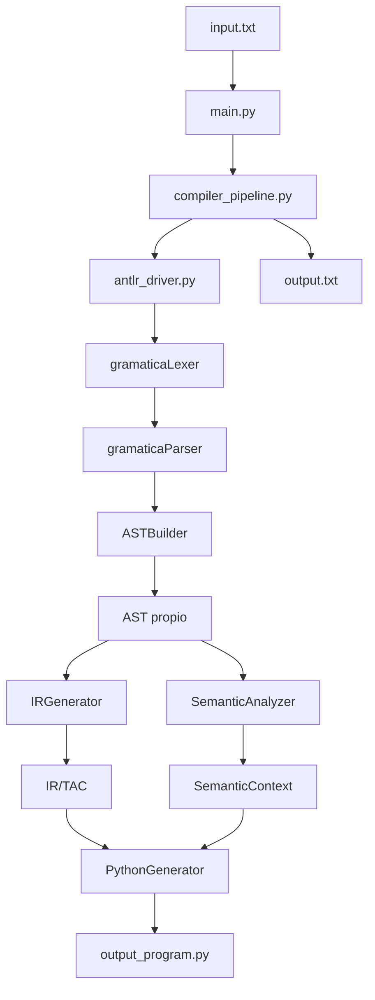

# 02. Arquitectura

## Vision general

El MiniCompilador esta organizado por fases. Cada modulo cumple una responsabilidad concreta: entrada, analisis, validacion, representacion intermedia, traduccion y pruebas.



## Modulos principales

### `main.py`

Es el punto de entrada de consola. Lee argumentos, ejecuta el pipeline, escribe archivos de salida y muestra logs con banner, fases y colores cuando la terminal los soporta.

Argumentos reales:

- `--input`
- `--output-python`
- `--output-log`
- `--run-tests`
- `--debug`

### `compiler_pipeline.py`

Contiene la funcion principal reutilizable:

```python
def compilar_codigo(codigo_fuente: str, ejecutar: bool = True) -> CompilationResult:
```

Esa funcion coordina parseo, semantica, IR/TAC, Python generado y ejecucion opcional.

### `antlr_driver.py`

Integra ANTLR4 con el proyecto. Carga lexer/parser generados, registra listeners de errores y devuelve un AST construido por `ASTBuilder`.

### `ast_nodes.py`

Define los nodos propios del AST:

- `GateDecl`
- `Connection`
- `OutputDecl`
- `Program`

Estos nodos son mas simples que el parse tree de ANTLR y contienen solo los datos necesarios para las siguientes fases.

### `ast_builder.py`

Implementa un visitor que recorre el parse tree generado por ANTLR4 y produce nodos definidos en `ast_nodes.py`.

### `semantic_analyzer/`

Contiene `SemanticAnalyzer`, encargado de validar reglas del dominio:

- senales declaradas
- duplicados
- cantidad de entradas
- conexiones existentes
- ciclos

### `codegen/`

Contiene dos generadores:

- `IRGenerator`: convierte AST en IR/TAC.
- `PythonGenerator`: convierte IR/TAC en Python.

### `generated/`

Contiene los archivos generados por ANTLR4. No se editan manualmente; se regeneran desde `gramatica.g4`.

### `tests/`

Contiene pruebas validas e invalidas y un runner automatico en `tests/run_tests.py`.

## Responsabilidad por carpeta

```txt
semantic_analyzer/  Analisis semantico y tabla de simbolos.
codegen/            Generacion de IR/TAC y Python.
generated/          Codigo generado por ANTLR4.
tests/              Casos de prueba y runner automatico.
docs/               Documentacion tecnica.
tools/              Herramientas locales como el JAR de ANTLR4.
```

## AST

El AST real esta basado en `dataclass`. Ejemplo:

```python
@dataclass(frozen=True)
class GateDecl:
    nombre: str
    tipo: str
    entradas: list[str]
    linea: int
```

La propiedad `linea` permite reportar errores semanticos con ubicacion.

## IR/TAC

El codigo intermedio usa la clase:

```python
@dataclass(frozen=True)
class IRInstruction:
    op: str
    target: str | None = None
    args: tuple[str, ...] = ()
```

Ejemplo real:

```txt
A = AND x y
B = NOT A
salida = B
PRINT salida
```

## Generador Python

`PythonGenerator` traduce operaciones IR a Python:

| IR | Python |
|---|---|
| `AND` | `and` |
| `OR` | `or` |
| `NOT` | `not` |
| `ASSIGN` | `=` |
| `PRINT` | `print(...)` |

## Tabla de simbolos

El proyecto no tiene una clase llamada literalmente `TablaSimbolos`, pero `SemanticAnalyzer` cumple esa funcion mediante:

| Estructura | Tipo | Funcion |
|---|---|---|
| `compuertas` | `dict[str, GateDecl]` | Guarda puertas declaradas. |
| `senales_conocidas` | `set[str]` | Registra senales disponibles. |
| `senales_externas_usadas` | `set[str]` | Registra entradas externas usadas. |
| `dependencias` | `dict[str, list[str]]` | Representa dependencias para DFS. |

