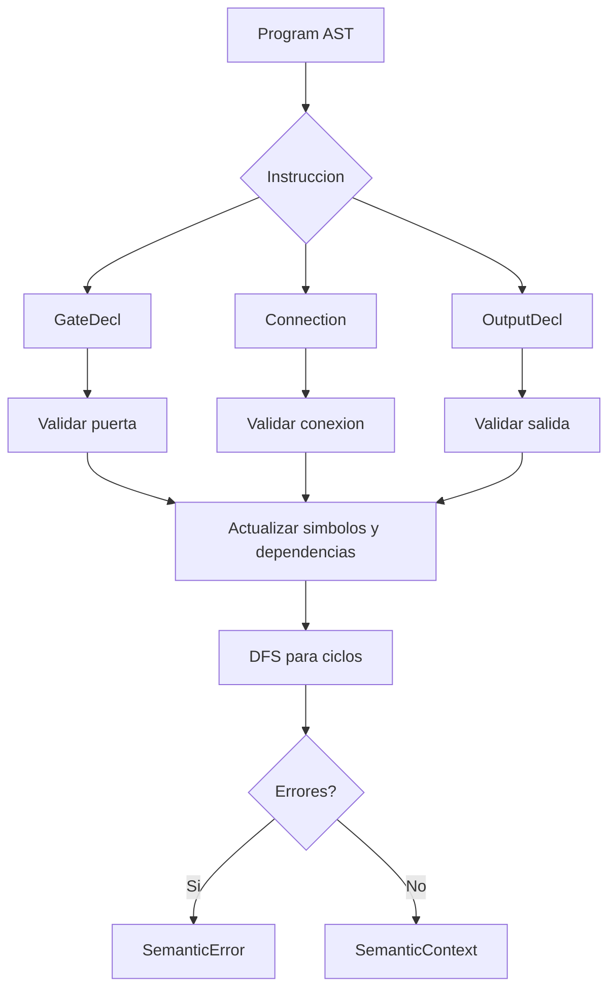

# 04. Analisis semantico

## Ubicacion

El analisis semantico esta implementado en:

```txt
semantic_analyzer/analyzer.py
```

La clase principal es `SemanticAnalyzer`.

## Entradas externas

Como el lenguaje no tiene una instruccion para declarar entradas, el proyecto permite tres senales externas por defecto:

```python
DEFAULT_EXTERNAL_VALUES = {
    "x": True,
    "y": False,
    "z": True,
}
```

Estas senales se agregan al conjunto `senales_conocidas` al iniciar el analisis.

## Tabla de simbolos

La tabla de simbolos esta implementada mediante estructuras internas:

| Estructura | Tipo | Funcion |
|---|---|---|
| `compuertas` | `dict[str, GateDecl]` | Puertas declaradas. |
| `senales_conocidas` | `set[str]` | Senales que pueden usarse. |
| `senales_externas_usadas` | `set[str]` | Entradas externas usadas en el programa. |
| `dependencias` | `dict[str, list[str]]` | Grafo de dependencias. |
| `errores` | `list[CompilerMessage]` | Errores acumulados. |

## Reglas implementadas

### Senales no declaradas

Si una senal no esta en `senales_conocidas`, se reporta error:

```txt
[semantico] linea 1, columna 0: La senal 'q' se usa como entrada de 'A' antes de declararse. Usa una puerta previa, una conexion previa o una entrada externa permitida: x, y, z.
```

### Puertas duplicadas

Si el nombre de puerta ya existe en `compuertas`, se reporta:

```txt
[semantico] linea 2, columna 0: La puerta 'A' ya fue declarada previamente.
```

### Nombre reservado de entrada externa

Si se intenta declarar una puerta llamada `x`, `y` o `z`, el analizador genera un error porque esos nombres pertenecen a entradas externas.

### Aridad de `NOT`

`NOT` debe recibir exactamente una entrada:

```txt
[semantico] linea 1, columna 0: La compuerta NOT 'A' debe recibir exactamente una entrada; recibio 2.
```

### Aridad de `AND` y `OR`

`AND` y `OR` deben recibir minimo dos entradas:

```txt
[semantico] linea 1, columna 0: La compuerta AND 'A' debe recibir minimo dos entradas; recibio 1.
```

```txt
[semantico] linea 1, columna 0: La compuerta OR 'A' debe recibir minimo dos entradas; recibio 1.
```

### Conectar desde senal inexistente

```txt
[semantico] linea 1, columna 0: No se puede conectar desde 'q' porque esa senal no existe todavia.
```

### Mostrar senal inexistente

```txt
[semantico] linea 1, columna 0: No se puede mostrar 'salida' porque esa senal no existe.
```

### Conexiones circulares

El analizador usa DFS sobre `dependencias`. Si una senal aparece de nuevo en la pila de recursion, existe un ciclo.

Ejemplo:

```txt
puerta A = AND(x, y);
conectar A a B;
conectar B a A;
mostrar A;
```

Mensaje:

```txt
[semantico] linea 0, columna 0: Conexion circular detectada: A -> B -> A.
```

## Flujo semantico



