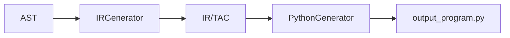

# 05. Generacion de codigo

## Vision general

La generacion de codigo tiene dos fases:

1. AST a IR/TAC con `IRGenerator`.
2. IR/TAC a Python con `PythonGenerator`.



## IRInstruction

El IR esta representado por:

```python
@dataclass(frozen=True)
class IRInstruction:
    op: str
    target: str | None = None
    args: tuple[str, ...] = ()
```

Campos:

- `op`: operacion.
- `target`: destino.
- `args`: argumentos.

## Generacion IR/TAC

Reglas reales:

| AST | IR/TAC |
|---|---|
| `GateDecl` con `AND` | `A = AND x y` |
| `GateDecl` con `OR` | `A = OR x y` |
| `GateDecl` con `NOT` | `B = NOT A` |
| `Connection` | `salida = B` |
| `OutputDecl` | `PRINT salida` |

## Ejemplo real

Entrada `input.txt`:

```txt
puerta A = AND(x, y);
puerta B = NOT(A);
conectar B a salida;
mostrar salida;
```

IR/TAC:

```txt
A = AND x y
B = NOT A
salida = B
PRINT salida
```

## Traduccion a Python

| IR | Python |
|---|---|
| `AND` | `and` |
| `OR` | `or` |
| `NOT` | `not` |
| `ASSIGN` | `=` |
| `PRINT` | `print(...)` |

Codigo generado:

```python
# Codigo Python generado por MiniCompilador
x, y = True, False
A = x and y
B = not A
salida = B
print(salida)
```

## Alcance real

El generador no hace optimizacion, no genera codigo maquina y no implementa simulacion propia. Su funcion es traducir de forma directa el IR/TAC a Python ejecutable.

