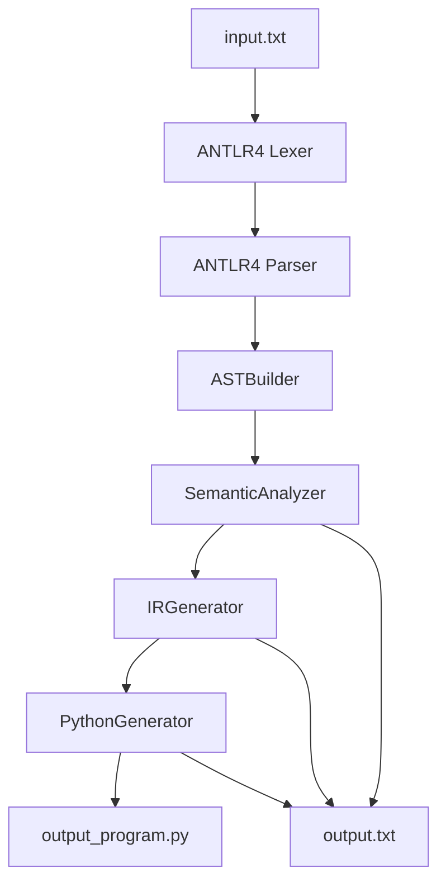
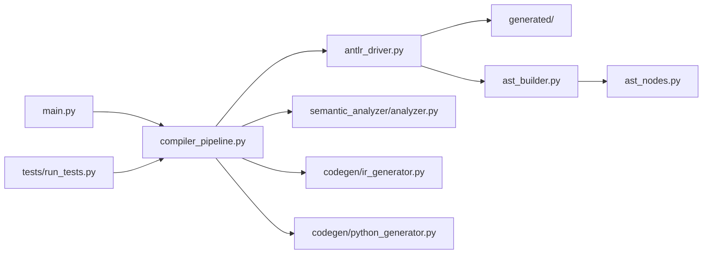
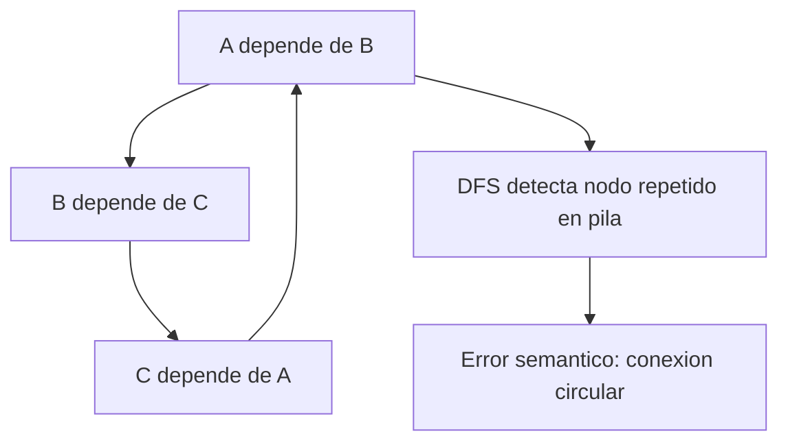

# Arquitectura del MiniCompilador

Este documento resume la arquitectura tecnica del compilador y sirve como base para el PDF final, la exposicion y las capturas de la demo.

## Flujo general

## Fases

1. Analisis lexico: ANTLR divide el codigo fuente en tokens.
2. Analisis sintactico: ANTLR valida que las instrucciones cumplan la gramatica.
3. AST: `ASTBuilder` transforma el parse tree en nodos simples de Python.
4. Analisis semantico: valida reglas del dominio de circuitos digitales.
5. IR/TAC: produce instrucciones intermedias sencillas.
6. Traduccion: convierte IR/TAC a Python ejecutable.

## Diagrama de modulos

## Decisiones tecnicas

- Se usan entradas externas `x`, `y`, `z` porque el lenguaje base no tiene declaracion de entradas.
- Los valores externos son deterministas para que la demo sea reproducible: `x=True`, `y=False`, `z=True`.
- El IR/TAC es textual y academico para que sea facil de explicar.
- La deteccion de ciclos usa DFS sobre el grafo de dependencias entre senales.
- Los archivos generados por ANTLR se guardan en `generated/`.
- El JAR de ANTLR se ubica en `tools/` para mantener limpia la raiz.

## Deteccion de ciclos

